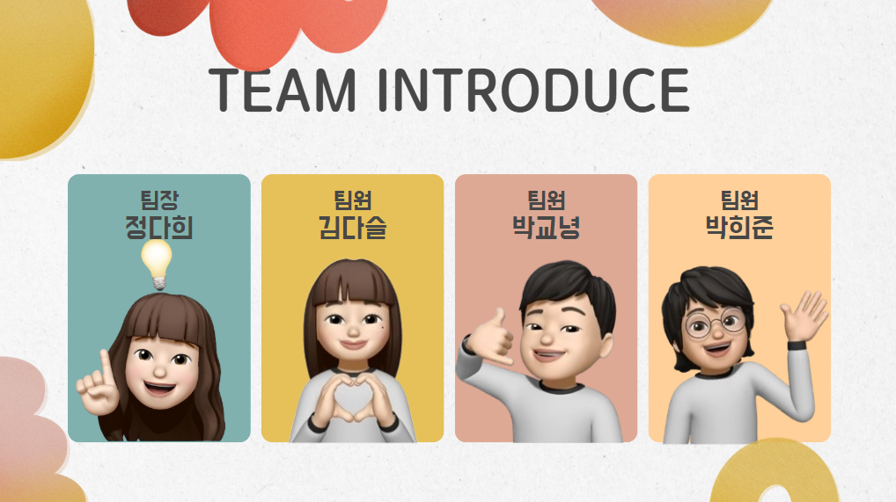
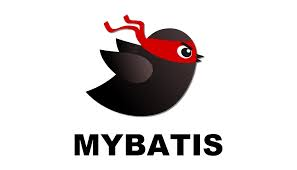
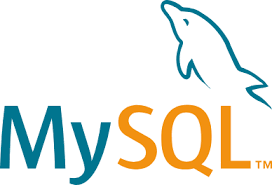
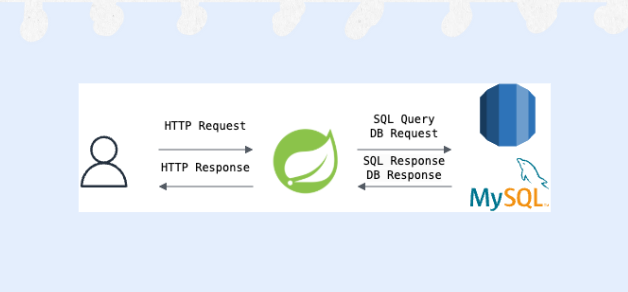
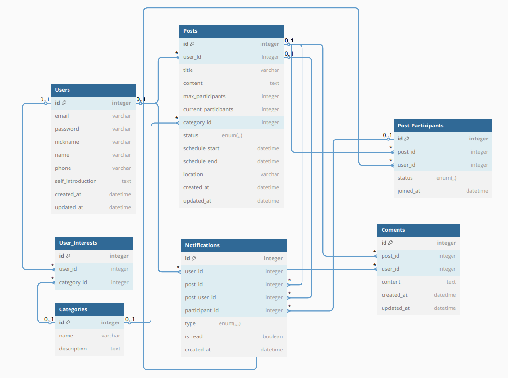
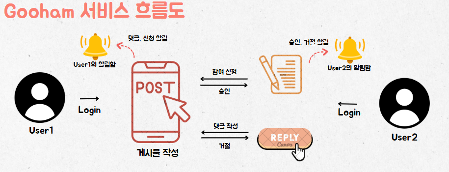

[](http://localhost:3000/)

# 0. Getting Started (시작하기)
```
$ npm run dev
```
[서비스 링크](http://localhost:3000/)

# 1. Project Overview (프로젝트 개요)
- 프로젝트 이름: GOOHAM
- 프로젝트 설명: 유레카의 다양한 주제와 관심사를 바탕으로 팀원을 모집하고, 함께할 사람들을 손쉽게 찾을 수 있는 플랫폼

# 2. Team Members (팀원 및 팀 소개)


# 3. Key Features (주요 기능)
### 3-1. 회원 관리
- 회원 가입: 이메일, 비밀번호, 본명, 닉네임, 생년월일, 전화번호, 관심사를 입력 후 가입합니다.
- 로그인: 이메일, 비밀번호를 입력하여 로그인합니다.
- 프로필 관리: 닉네임, 관심사, 한 줄 소개 등을 수정합니다.
- 비밀번호 재설정: 이메일 인증을 통해 비밀번호를 재설정합니다.
- 회원 탈퇴: 비밀번호 인증을 통해 회원 데이터를 제거합니다.
### 3-2. 게시글 관리
- 게시글 작성
  - 게시글 생성: 제목, 일정, 참여 인원, 장소, 관심사 등을 입력하여 게시글을 생성합니다.
  - 게시글 수정: 작성자가 게시글의 내용, 상태 등을 수정합니다.
  - 게시글 삭제: 작성자가 게시글을 삭제합니다.
- 게시글 조회
  - 게시글 목록 조회: 게시글 확인 및 유형 별 필터를 적용하여 조회합니다.
  - 게시글 상세 조회: 특정 게시글의 상세 내용을 확인합니다.
- 댓글 기능: 댓글 작성, 수정, 삭제 기능을 사용합니다.
### 3-3. 모집 참여 관리
- 게시글 참여 신청/취소: 게시글에 참여 신청 및 취소를 합니다.
- 신청 승인/거절: 작성자가 참여 신청을 승인 및 거절합니다.
- 참여자 목록 조회: 게시글의 참여자 목록을 확인합니다.
- 신청자 현재 상태 확인: 신청자의 현재 상태(대기, 승인, 거절)를 확인합니다.
### 3-4. 개별 요청 (알림)
- 요청 전송: 게시글 작성자에게 별도의 요청 메시지를 전송합니다.
- 요청 처리: 요청에 대해 작성자가 승인 및 거절을 합니다.
- 댓글: 게시글에 댓글 추가 시 작성자에게 알림 메시지를 전송합니다.

# 4. Tasks & Responsibilities (작업 및 역할 분담_이미지는 슬랙 개인 이미지로 변경할 예정?)
| 정다희 |  | ● 알림 관련 API 구현<br>- 알림 삭제 스케줄러 구현<br>- 참여 요청 내역 스케줄러 구현<br>- swagger 도입<br>- 게시글 관련 API 연동<br>- 댓글 관련 API 연동<br>- 게시글 검색 UI page 작성 |
|:-----:|:-----:|:-----|
| 김다슬 |  | ● 회원 가입 구현<br>● 로그인, 로그아웃 구현<br>● 회원 탈퇴 구현<br>● 프로필 조회, 수정 구현<br>● 비밀번호 찾기, 변경 구현<br>● 이메일 인증 구현<br>● JWT 토큰 사용 구현<br>● 로그인, 로그아웃 API 연동<br>● 마이페이지 API 연동<br>● 비밀번호 재설정 API 연동<br>● ㅂ |
| 박교녕 |  | ● 참여신청 관련 API 구현<br>● 댓글 관련 API 구현<br>● 모집게시글 관련 API 구현<br>● 기본 ResponseDTO, PageableDTO 및 Exception 포멧 구축<br>● API 연동 |
| 박희준 |  | ● 게시글 작성, 수정, 삭제, 조회 및 상세 조회 구현<br>● 마이페이지 관련 피그마 구현<br>● 로그인, 회원가입, 비밀번호 재설정 UI page 작성<br>● 로그인 API 연동 |

# 5. Technology Stack (기술 스택)
### 5.1 Language
|  |  |
|:-----:|:-----:|
| TypeScript |  |
| CSS |  |
| JavaScript |  |
| Java |  |
### 5.2 Library_Frontend
|  |  |  |
|:-----:|:-----:|:-----:|
| Next.js |  | 15.3.1 |
| React |  | 19.0.0 |
| Tailwind CSS |  | 4.1.5 |
| SASS |  | 1.87.0 |
| Zustand |  | 5.0.4 |
| Axios |  | 1.9.0 |
### 5.3 Library_Backend
|  |  |  |
|:-----:|:-----:|:-----:|
| Spring Boot |  | 3.4.3 |
| JPA |  | - |
| MyBatis |  | 3.0.4 |
| MySQL |  | - |
| JWT |  | 0.11.5 |
| AWS S3 |  | 1.12.678 |
### 5.4 Cooperation
|  |  |
|:-----:|:-----:|
| GitHub |  |
| Notion |  |
| Slack |  |
### 5.5 Flow


# 6. Project Structure (프로젝트 구조)
### 6.1 Backend
```
src/main/java/com/example/project
 ├── config                            # 설정 관련 (Security, CORS, DB 설정 등)
 │   ├── SecurityConfig.java           # Spring Security 설정
 │   ├── CORSConfig.java              # CORS 설정
 │   ├── DatabaseConfig.java          # 데이터베이스 설정 (DataSource, JPA 등)
 │   └── ApplicationConfig.java       # 애플리케이션 공통 설정
 ├── domain                            # 엔터티 (JPA 사용 시)
 │   ├── user                          # 회원 관리 관련 엔터티
 │   │   └── User.java                 # User 엔터티
 │   ├── post                          # 모집 게시글 관련 엔터티
 │   │   └── Post.java                 # Post 엔터티
 │   ├── participation                 # 모집 참여 관련 엔터티
 │   │   └── Participation.java        # Participation 엔터티
 │   └── notification                  # 개별 요청 관련 엔터티
 │       └── Notification.java         # Notification 엔터티
 ├── dto                               # DTO (Data Transfer Object)
 │   ├── user                          # 회원 관련 DTO
 │   │   └── UserDTO.java              # User DTO
 │   ├── post                          # 모집 게시글 관련 DTO
 │   │   └── PostDTO.java              # Post DTO
 │   ├── participation                 # 모집 참여 관련 DTO
 │   │   └── ParticipationDTO.java     # Participation DTO
 │   └── notification                  # 개별 요청 관련 DTO
 │       └── NotificationDTO.java      # Notification DTO
 ├── repository                        # JPA Repository (데이터 접근)
 │   ├── user                          # 회원 관련 Repository
 │   │   └── UserRepository.java       # User Repository
 │   ├── post                          # 모집 게시글 관련 Repository
 │   │   └── PostRepository.java       # Post Repository
 │   ├── participation                 # 모집 참여 관련 Repository
 │   │   └── ParticipationRepository.java # Participation Repository
 │   └── notification                  # 개별 요청 관련 Repository
 │       └── NotificationRepository.java # Notification Repository
 ├── service                           # 비즈니스 로직 처리
 │   ├── user                          # 회원 관련 서비스
 │   │   └── UserService.java          # User 서비스
 │   ├── post                          # 모집 게시글 관련 서비스
 │   │   └── PostService.java          # Post 서비스
 │   ├── participation                 # 모집 참여 관련 서비스
 │   │   └── ParticipationService.java # Participation 서비스
 │   └── notification                  # 개별 요청 관련 서비스
 │       └── NotificationService.java  # Notification 서비스
 ├── controller                        # API 엔드포인트
 │   ├── UserController.java           # 사용자 관련 API 엔드포인트
 │   ├── PostController.java           # 모집 게시글 관련 API 엔드포인트
 │   ├── ParticipationController.java  # 모집 참여 관련 API 엔드포인트
 │   └── NotificationController.java   # 개별 요청 관련 API 엔드포인트
 ├── exception                         # 예외 처리 관련
 │   ├── GlobalExceptionHandler.java   # 전역 예외 처리
 │   └── CustomExceptions.java         # 사용자 정의 예외들 (예: UserNotFoundException)
 ├── security                          # Spring Security 관련
 │   ├── SecurityConfig.java           # Spring Security 설정
 │   └── JwtUtils.java                # JWT 유틸리티 클래스 (JWT 생성/검증 등)
 └── ProjectApplication.java           # Spring Boot 애플리케이션 진입점
```
### 6.2 Frontend
```
GooHam-Frontend
├─ components.json                 # UI 컴포넌트 관련 설정 파일
├─ eslint.config.mjs              # ESLint 설정 파일 (코드 스타일 검사 및 자동 수정용)
├─ fonts
│  └─ Pretendard.css              # Pretendard 폰트의 CSS 정의
├─ next.config.ts                 # Next.js 설정 파일
├─ package-lock.json              # 패키지 버전 고정 파일 (자동 생성됨)
├─ package.json                   # 프로젝트 의존성, 스크립트 등 기본 설정 파일
├─ postcss.config.js              # Tailwind CSS 등 PostCSS 관련 설정
├─ public                         # 정적 파일을 담는 폴더 (Next.js에서 자동 제공)
│  ├─ fonts                       # Pretendard 폰트 파일
│  ├─ images                      # 프로젝트에 사용되는 이미지들
│  ├─ login.png                   # 로그인 페이지 이미지
│  └─ logo.png                    # 프로젝트 로고 이미지
├─ README.md                      # 프로젝트 설명서
├─ src                            # 실제 소스 코드가 담긴 폴더
│  ├─ app                         # Next.js의 라우팅 기반 디렉토리
│  │  ├─ (afterAuth)             # 인증 후 접근 가능한 페이지들
│  │  │  ├─ layout.tsx           # 인증 후 공통 레이아웃
│  │  │  ├─ mypage               # 마이페이지 관련 페이지
│  │  │  │  ├─ DivWrapper        # 마이페이지 내부 레이아웃 컴포넌트
│  │  │  │  │  └─ sections       # 마이페이지 섹션별 UI 컴포넌트
│  │  │  │  └─ page.tsx          # 마이페이지 진입점
│  │  │  ├─ notification         # 알림 페이지
│  │  │  │  └─ page.tsx
│  │  │  ├─ page.tsx             # 인증 후 기본 홈 또는 리다이렉션
│  │  │  ├─ participation        # 참여 관리 관련 페이지
│  │  │  │  ├─ Alertmessage.tsx  # 참여 승인/거절 알림
│  │  │  │  ├─ page.tsx
│  │  │  │  └─ participtiondata.tsx
│  │  │  ├─ postDetail           # 게시글 상세 페이지
│  │  │  │  ├─ page.tsx
│  │  │  │  └─ [id]              # 게시글 ID별 동적 라우팅
│  │  │  │     └─ page.tsx
│  │  │  ├─ posts                # 전체 게시글 목록 및 작성
│  │  │  │  ├─ page.tsx
│  │  │  │  ├─ postData.tsx
│  │  │  │  └─ write             # 게시글 작성
│  │  │  │     ├─ FileInput.tsx  # 파일 업로드 컴포넌트
│  │  │  │     └─ page.tsx
│  │  │  └─ users                # 사용자 관련 페이지
│  │  │     ├─ myActivity
│  │  │     │  └─ page.tsx
│  │  │     └─ profile
│  │  │        └─ page.tsx
│  │  ├─ (beforeAuth)            # 인증 전 페이지
│  │  │  ├─ account              # 계정 관련 기능
│  │  │  │  ├─ repassword        # 비밀번호 재설정
│  │  │  │  │  └─ page.tsx
│  │  │  │  ├─ signin            # 로그인
│  │  │  │  │  └─ page.tsx
│  │  │  │  └─ signup            # 회원가입
│  │  │  │     └─ page.tsx
│  │  │  └─ layout.tsx           # 인증 전 공통 레이아웃
│  │  ├─ layout.tsx              # 전체 공통 레이아웃
│  │  └─ page.module.css         # 홈 또는 전역 스타일 모듈
│  ├─ components                 # 재사용 가능한 컴포넌트들
│  │  ├─ api                     # API 요청 함수 정의
│  │  ├─ comments                # 댓글 관련 컴포넌트
│  │  ├─ common                  # 공통 컴포넌트 및 전역 상태 관리
│  │  ├─ hooks                   # 커스텀 훅 정의
│  │  ├─ posts                   # 게시글 상세/참여자 컴포넌트
│  │  └─ ui                      # 디자인 시스템 기반 UI 컴포넌트
│  ├─ lib
│  │  └─ utils.ts                # 전역 유틸리티 함수
│  ├─ store                      # (예정) 전역 상태 관리용 파일
│  ├─ styles
│  │  └─ global.css              # 전체 프로젝트 공통 CSS
│  ├─ types                      # 타입스크립트 타입 정의 파일들
│  └─ utils                      # axios 인스턴스, 상태 관리 유틸 등
├─ tailwind.config.js            # Tailwind CSS 설정 파일
└─ tsconfig.json                 # TypeScript 설정 파일
```

# 7. Development Workflow (개발 워크플로우)
### 7.1 Branch & Commit Strategy (브랜치 & 커밋 전략)
📎 브랜치 종류
```
🛠 main : 실제로 서비스가 제공되는 브랜치 (=배포 상태)
   develop : 다음 출시 버전 대비 위해 개발하는 브랜치 (=개발)
   feature/ : 추가 기능 개발 브랜치 → develop 브랜치로 (=기능 개발)
   fix/ : 발생한 버그를 수정하는 브랜치
   test/ : test code 개발 브랜치
```
📎 브랜치 규칙 🌟
 - 브랜치는 `feature/이슈번호-기능명` 형태의 이름을 사용한다
    (Ex. **feature/1-login**, fix/2-edit-nickname, test/1-login)
 - 브랜치를 사용한 개발을 완료한 후, PR까지 완료하면 해당 브랜치는 삭제한다
 - 전체적인 흐름은 feature → develop → main 순으로 진행된다
 - 커밋은 모두 소문자로 작성한다. *ex) feat: 로그인 API 생성, fix: 잘못된 응답값 수정*

📎 커밋컨벤션 (커밋 규칙)

| 태그 이름 | 설명 |
| :----|:----|
| feat | 새로운 기능을 추가할 경우 |
| design | CSS 등 사용자 UI 디자인 변경 |
| !breaking change | 커다란 API 변경의 경우 |
| style | 코드 포맷 변경, 세미 콜론 누락, 코드 수정이 없는 경우 |
| comment | 필요한 주석 추가 및 변경 |
### 7.2 ERD (Entity Relationship Diagram)


### 7.3 System Flow


# 8. API 명세서
API 명세서: https://www.notion.so/API-1b5d20939aae80368dacdfa8537d7718?pvs=25

# 9. 기능 명세서
기능 명세서: https://www.notion.so/1b4d20939aae80df9d3ce179400b2533?pvs=25

# 10. Coding Convention ??

